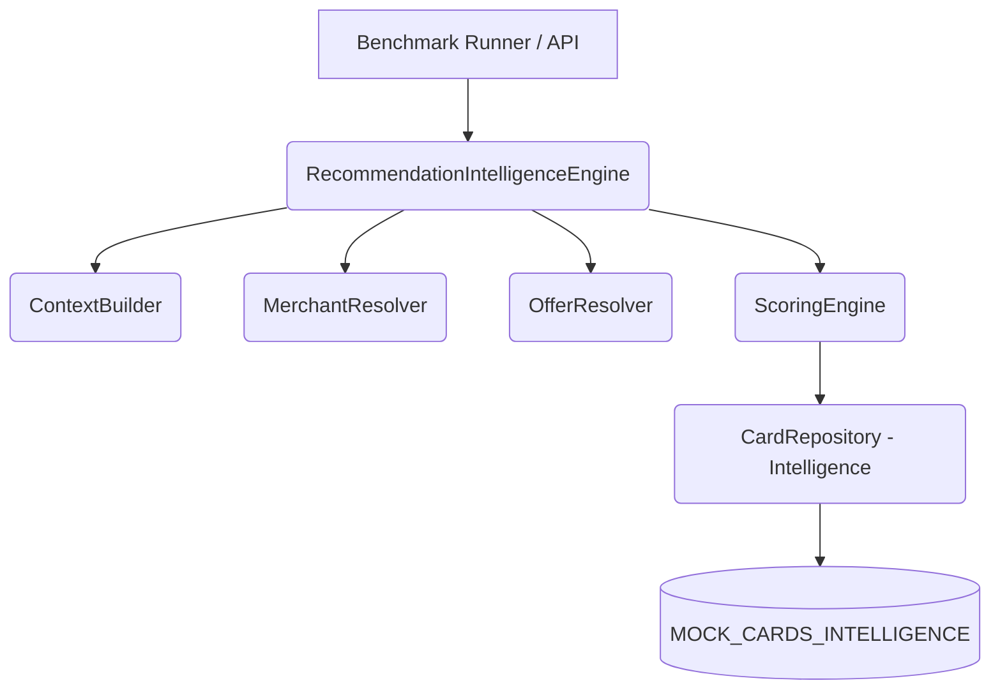
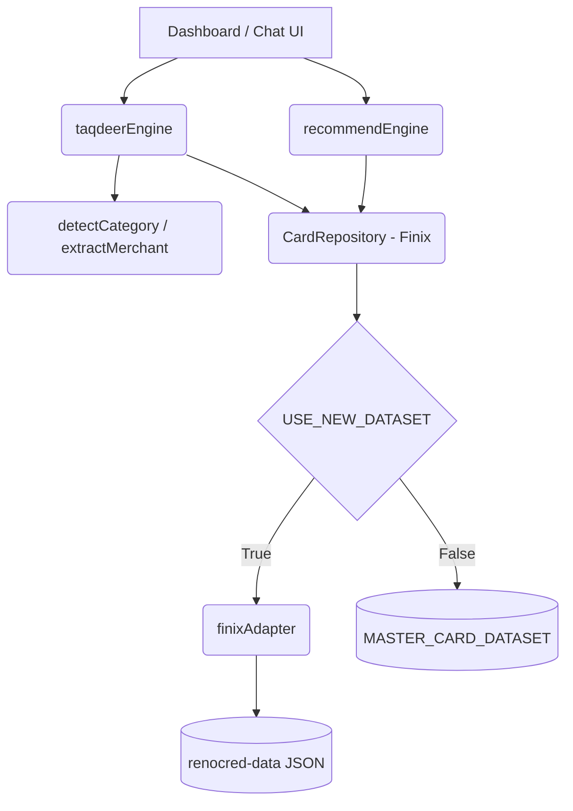

# Engine Unification Plan

## 1. Engine Analysis

The repository currently houses five distinct engines dealing with recommendation, ranking, and intelligence. This fragmentation has resulted in diverging datasets, duplicated merchant resolution, and inconsistent scoring logic.

### 1.1 RecommendationIntelligenceEngine (`src/features/recommendation/intelligence/recommendationIntelligenceEngine.ts`)
- **Purpose:** Primary backend-aligned robust calculation engine used by the evaluation and benchmarking suite.
- **Entry point:** `evaluateRecommendation(input)`
- **Input schema:** `RecommendationContextInput` (Merchant, amount, mode, transactionDate, ownedCards)
- **Output schema:** `RecommendationIntelligenceOutput` (Best card, composite score, expected savings, alternatives, trace)
- **Internal dependencies:** `ScoringEngine`, `RecommendationContextBuilder`, `MerchantResolver`, `OfferResolver`, `CardRepository` (Mock data).
- **Helper modules:** `RecommendationTraceLogger`, `ConfidenceCalculator`
- **Reward calculations:** Computes exact expected reward points and precise INR savings based on transaction amounts.
- **Merchant categorization:** Uses `MerchantResolver` for fuzzy string matching and strict category mapping.
- **Scoring model:** Multi-Factor Scoring (Base Reward + Category Multiplier + Offer Bonus + Network/Issuer weighting).
- **Ranking model:** Ranks candidates by `compositeScore` descending.
- **Savings calculation:** Calculates exact INR savings (`expectedSavings`) applying category multipliers and offer discounts.
- **Confidence calculation:** Outputs 0-100% confidence based on merchant match accuracy and offer applicability.
- **Card filtering:** Filters dynamically based on `mode` (e.g., `wallet_optimisation` strictly filters to `ownedCardIds`).
- **Tie-breaking logic:** Implicit via `compositeScore` precision.

### 1.2 RecommendationEngine (Static Wrapper) (`src/features/recommendation/recommendationEngine.ts`)
- **Purpose:** Static legacy wrapper around the older version of the intelligence engine.
- **Entry point:** `getBestCardRecommendation(input)`
- **Input schema:** `RecommendationInput`
- **Output schema:** `RecommendationOutput`
- **Internal dependencies:** `CardRanker`, `MerchantResolver`, `OfferResolver`, `ConfidenceCalculator`.
- **Logic:** Delegates entirely to static helpers. Largely functionally identical to `RecommendationIntelligenceEngine` but less extensible.

### 1.3 TaqdeerEngine (`src/features/finix/lib/taqdeerEngine.ts`)
- **Purpose:** AI-powered natural language chatbot and local heuristic fallback engine for UI queries.
- **Entry point:** `generateTaqdeerResponse(query, userCards)`
- **Input schema:** `string` (Natural language query), `CardData[]` (User wallet).
- **Output schema:** `TaqdeerMessage` (Markdown text + `FinixCard[]` attachments).
- **Internal dependencies:** `CARD_DATASET` (via `FinixCardRepository`), `detectCategory`, `extractMerchant`.
- **Reward calculations:** Naive percentage read from `FinixCard.rewards[].rate`.
- **Merchant categorization:** Basic keyword matching via `POPULAR_MERCHANTS` array and regex.
- **Scoring model:** Simple heuristic (finds highest `rate` % for an inferred category).
- **Ranking model:** Ranks by `rate` % descending.
- **Savings calculation:** None (Does not compute projected savings).
- **Confidence calculation:** None.
- **Card filtering:** Filters based on query intent (e.g., free cards, specific bank, lounge threshold).
- **Tie-breaking logic:** None.

### 1.4 RecommendEngine (`src/features/finix/lib/recommendEngine.ts`)
- **Purpose:** Client-side general-purpose UI recommender for user onboarding flows (e.g., RecommenderPanel).
- **Entry point:** `recommendCards(profile, limit)`
- **Input schema:** `UserProfile` (Income, CIBIL, Top Categories).
- **Output schema:** `RecommendedCard[]` (Extends `FinixCard` with `matchScore` and `matchPercent`).
- **Internal dependencies:** `CARD_DATASET` (via `FinixCardRepository`).
- **Reward calculations:** Priority-weighted multiplier (Top category = 5x weight, second = 4x, etc.).
- **Merchant categorization:** N/A (Operates abstractly on `SpendCategory`).
- **Scoring model:** CIBIL Tier + Salary Tier + Spend Tier + Fee penalty + Lounge bonus + Weighted Category Rewards.
- **Ranking model:** Ranks by `matchScore` descending.
- **Savings calculation:** None.
- **Confidence calculation:** None.
- **Card filtering:** Hard eligibility gates (minIncome, minCibil, maxAnnualFee).
- **Tie-breaking logic:** None.

### 1.5 CardEngine (`src/features/card-intelligence/cardEngine.ts`)
- **Purpose:** Simple utility for UI filtering, searching, and basic Premium scoring comparison.
- **Entry point:** `compareCards(cardIds)`, `searchCards(query)`
- **Scoring model:** Arbitrary Premium Score (Super Premium = 98, Premium = 85, Entry = 65).
- **Ranking model:** Ranks strictly by `premiumScore`.

---

## 2. Comparison Analysis

- **Duplicated Logic:** We have three entirely disconnected ranking algorithms (`CardRanker`/`ScoringEngine`, `scoreCard` in `recommendEngine`, and `getBestCardForCategory` in `taqdeerEngine`). Merchant resolution is duplicated across `MerchantResolver` and `POPULAR_MERCHANTS`.
- **Conflicting Logic (The Data Split):** The datasets conflict severely. The Intelligence engines use `CreditCardIntelligence` (mock data), while the `finix` UI engines use `FinixCard` (connected to the live `renocred-data` adapter). 
- **Missing Features:** The UI engines (`Taqdeer` & `recommendEngine`) completely lack exact INR savings projection, confidence scoring, and dynamic offer resolution.
- **Richer Implementation:** `RecommendationIntelligenceEngine` is vastly superior. It computes precise mathematical savings, handles complex merchant resolution, and provides a structured trace of its reasoning.

---

## 3. Dependency Graphs

### Engine A: Recommendation Intelligence Engine

### Engine B: Taqdeer / Recommend Engine (UI)

---

## 4. Canonical Engine Analysis

**Recommended Canonical Engine:** `RecommendationIntelligenceEngine`

**Why:** It is the only engine capable of executing deterministic, mathematically sound expected savings calculations. The UI engines rely on abstract point-scoring heuristics (e.g., adding 40 points for CIBIL, multiplying a category by 5) which do not translate to real-world monetary savings. 
**Benefits:** 
- Unified mathematical foundation.
- Extensible `ScoringEngine` supports dynamic offer integration.
- Precise trace logging enables explainable AI.
**Risks:** 
- Heavy coupling to the `CreditCardIntelligence` schema.
- UI components currently expect the simpler `FinixCard` outputs.
**Migration effort:** **HIGH.** It requires discarding the `FinixCard` adapter built in Phase 2, writing a new adapter that outputs `CreditCardIntelligence`, and completely refactoring all frontend UI components to render the new schema.

---

## 5. Unification Plan

Moving from fragmented heuristics to a single canonical intelligence architecture requires three phases:

### Phase A: Schema & Adapter Alignment
1. **Deprecate `FinixCard`:** Abandon the legacy `FinixCard` interface. It lacks the depth required for true intelligence.
2. **Rewrite Adapter:** Create `renocred-data/adapters/intelligenceAdapter.ts` to map the raw `renocred-data` JSON directly into the robust `CreditCardIntelligence` interface.
3. **Connect Repository:** Point `src/features/card-intelligence/cardRepository.ts` to the new adapter, officially killing `MOCK_CARDS_INTELLIGENCE`.

### Phase B: Engine Consolidation
1. **Refactor Taqdeer Engine:** Strip out the local heuristic searches and hardcoded `POPULAR_MERCHANTS`. Route all Taqdeer fallback queries directly through `RecommendationIntelligenceEngine.evaluateRecommendation()`.
2. **Refactor Profile Recommender:** Convert the `UserProfile` object into a mock transaction history context, passing it into the `RecommendationIntelligenceEngine` to calculate projected annual savings across a user's stated spend limits, returning monetarily ranked results.

### Phase C: UI Migration & Cleanup
1. **Migrate Components:** Update `RecommenderPanel`, `CardComparisonPanel`, and Dashboard widgets to accept `CreditCardIntelligence` objects instead of `FinixCard`.
2. **Purge:** Delete `taqdeerEngine.ts` local heuristics, `recommendEngine.ts`, `cardEngine.ts`, and the entire `FinixCardRepository`. The repository will now have exactly one data model and one engine.
