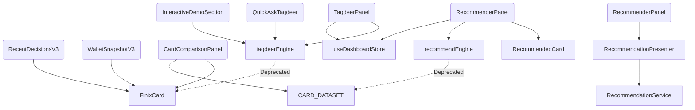

# UI Migration Blueprint & Dependency Audit

## Executive Summary
This document serves as the comprehensive blueprint for Phase C of the Engine Unification Plan. It details every React component that currently depends on the legacy `FinixCard`, `RecommendedCard`, `recommendEngine`, or `taqdeerEngine`. By utilizing the newly created `RecommendationPresenter` and associated ViewModels, this migration strategy maps out the exact sequence and requirements to decouple the UI from legacy data models, achieving a 100% unified presentation layer.

---

## Dependency Graph

---

## Component Inventory & Batches

### Batch 1: Read-only display cards
*These components simply accept cards as props and render them. They are the easiest to migrate and do not invoke recommendation engines directly.*

#### 1. WalletSnapshotV3
- **Location:** `src/features/dashboard/components/v3/WalletSnapshotV3.tsx`
- **Purpose:** Displays the user's currently owned cards in a wallet view.
- **Props:** `{ userCards: FinixCard[] }`
- **Current Data Model:** `FinixCard`
- **Required ViewModel:** `WalletRecommendationViewModel` (or array of `CardViewModel`)
- **Presenter Methods Needed:** `presentWallet` or `presentCard`
- **Dependencies:** None
- **Hooks/Stores Used:** None
- **Risk Level:** Low
- **Migration Complexity:** Easy
- **Estimated Time:** 15 mins

#### 2. RecentDecisionsV3
- **Location:** `src/features/dashboard/components/v3/RecentDecisionsV3.tsx`
- **Purpose:** Shows recently acquired or viewed cards.
- **Props:** `{ userCards: FinixCard[] }`
- **Current Data Model:** `FinixCard`
- **Required ViewModel:** Array of `CardViewModel`
- **Presenter Methods Needed:** `presentCard`
- **Dependencies:** None
- **Hooks/Stores Used:** None
- **Risk Level:** Low
- **Migration Complexity:** Easy
- **Estimated Time:** 15 mins

---

### Batch 2: Recommendation panels
*These components actively trigger the legacy recommendation engine.*

#### 3. RecommenderPanel
- **Location:** `src/features/finix/components/RecommenderPanel.tsx`
- **Purpose:** Wizard that takes user preferences, invokes engine, and displays matching cards.
- **Props:** None
- **Current Data Model:** `RecommendedCard`
- **Required ViewModel:** `RecommendationCardViewModel`
- **Presenter Methods Needed:** `presentCard`
- **Dependencies:** `recommendCards`, `CATEGORIES_LIST` from `recommendEngine`
- **Hooks/Stores Used:** `useDashboardStore`
- **Risk Level:** High (Core user flow)
- **Migration Complexity:** Hard
- **Estimated Time:** 2 hours

---

### Batch 3: Comparison UI
*These components rely heavily on hardcoded dataset properties and sorting algorithms.*

#### 4. CardComparisonPanel
- **Location:** `src/features/finix/components/CardComparisonPanel.tsx`
- **Purpose:** Allows users to compare multiple cards side-by-side.
- **Props:** None
- **Current Data Model:** `FinixCard`
- **Required ViewModel:** `CardComparisonViewModel`
- **Presenter Methods Needed:** `presentComparison`
- **Dependencies:** `CARD_DATASET`
- **Hooks/Stores Used:** None
- **Risk Level:** Medium
- **Migration Complexity:** Medium
- **Estimated Time:** 1 hour

---

### Batch 4: Chat (Taqdeer Engine)
*These components interact with the localized LLM engine which currently parses `FinixCard` properties.*

#### 5. TaqdeerPanel
- **Location:** `src/features/finix/components/TaqdeerPanel.tsx`
- **Purpose:** Floating AI chat assistant widget.
- **Props:** None
- **Current Data Model:** `TaqdeerMessage`, `FinixCard` (via context)
- **Required ViewModel:** N/A (Chat UI)
- **Presenter Methods Needed:** Requires adapting `taqdeerEngine` to use `RecommendationService` under the hood.
- **Dependencies:** `generateTaqdeerResponse`
- **Hooks/Stores Used:** `useDashboardStore`
- **Risk Level:** High
- **Migration Complexity:** Hard
- **Estimated Time:** 2-3 hours

#### 6. QuickAskTaqdeer
- **Location:** `src/features/dashboard/components/v3/QuickAskTaqdeer.tsx`
- **Purpose:** Quick prompt chips to launch Taqdeer.
- **Props:** None
- **Current Data Model:** N/A
- **Required ViewModel:** N/A
- **Presenter Methods Needed:** Same as TaqdeerPanel
- **Dependencies:** `generateTaqdeerResponse`
- **Hooks/Stores Used:** None
- **Risk Level:** Low
- **Migration Complexity:** Easy
- **Estimated Time:** 30 mins

#### 7. InteractiveDemoSection
- **Location:** `src/public-platform/components/home/InteractiveDemoSection.tsx`
- **Purpose:** Marketing landing page demo of Taqdeer.
- **Props:** None
- **Current Data Model:** N/A
- **Required ViewModel:** N/A
- **Presenter Methods Needed:** Same as TaqdeerPanel
- **Dependencies:** `generateTaqdeerResponse`
- **Hooks/Stores Used:** None
- **Risk Level:** Medium (Public facing)
- **Migration Complexity:** Medium
- **Estimated Time:** 45 mins

---

## Migration Order

The migration must occur in a strict bottom-up dependency order to ensure the application remains stable and deployable at every step.

1. **Batch 1 (Read-only Display):** Update `WalletSnapshotV3` and `RecentDecisionsV3` to accept `CardViewModel`.
2. **Batch 3 (Comparison UI):** Update `CardComparisonPanel` to use `CardComparisonViewModel` and query `RecommendationService` instead of reading `CARD_DATASET` directly.
3. **Batch 2 (Recommendation Panels):** Refactor `RecommenderPanel` to invoke `RecommendationService.recommend()` and map results via `RecommendationPresenter`.
4. **Batch 4 (Chat):** Refactor `taqdeerEngine` to consume the canonical `RecommendationResult` from the Service layer, then update the chat UIs.

---

## Compatibility Strategy

To ensure zero downtime during the migration, we will utilize the following temporary bridges:
1. **`RecommendationService.legacyRecommend()`**: Available if any intermediate hook needs to fetch canonical results but output legacy shapes temporarily.
2. **`mapToCardViewModel()`**: Can be used inline within parent components (e.g., Dashboard) that fetch legacy data but pass it down to newly migrated child components.

---

## Final Cleanup Order (Delete Candidates)

Once all batches are migrated and verified, the following files will become completely orphaned and **must be safely deleted**:
1. `src/features/finix/data/cardDataset.ts` (and its JSON source if not used elsewhere)
2. `src/features/finix/lib/recommendEngine.ts`
3. The legacy `ICardDataSource` implementations tied to Finix (`LegacyCardDataSource.ts`).

---

## Risk Matrix & Rollback Strategy

| Risk Area | Impact | Mitigation | Rollback Plan |
|-----------|--------|------------|---------------|
| Aesthetic Loss | High (UI degrades without legacy gradients) | Rely on `getCardGradient` fallback in `formatters.ts` | Revert to `FinixCard` props temporarily |
| Taqdeer AI Hallucination | High (LLM expects old context) | Update the system prompt in `taqdeerEngine` to understand `RecommendationResult` schema | Revert `taqdeerEngine.ts` only |
| Dashboard Store Drift | Medium | Update `useDashboardStore` userCards to store `CardViewModel` IDs instead of full objects if possible | Keep legacy state alongside new state |

## Definition of Done
The migration is complete when `grep -r "FinixCard" src/` and `grep -r "recommendEngine" src/` yield exactly **zero** matches in the UI component layer, and all unit/e2e tests pass using the `RecommendationService`.
