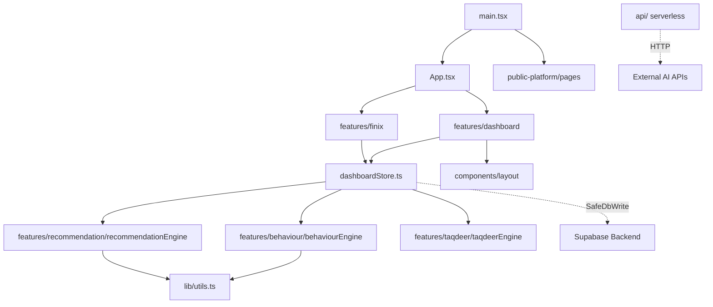

# Phase 2: Project Structure

## Directory Overview

### `/api`
*   **Purpose**: Vercel Serverless Functions.
*   **Responsibilities**: Handling backend requests that cannot be safely done on the client, such as masking the `VITE_AI_API_URL` during health checks (`health-ai.ts`) or sending transactional emails (`send-email.ts`) using secure environment variables.
*   **Dependencies**: Relies on `@vercel/node`.
*   **Who imports it**: The frontend client `fetch` calls.
*   **Reusable?**: No, strictly single-purpose endpoints.
*   **Should it exist?**: Yes, vital for keeping secrets out of the Vite client bundle.

### `/supabase`
*   **Purpose**: Backend-as-a-Service configuration.
*   **Responsibilities**: Holds database migration scripts (`migrations/`) detailing the PostgreSQL schema, Enums, and Triggers.
*   **Dependencies**: N/A (SQL scripts).
*   **Should it exist?**: Yes, serves as the single source of truth for the database schema.

### `/src/components`
*   **Purpose**: Generic, global React components.
*   **Responsibilities**: Divided into `layout/` (Sidebar, DashboardLayout) and `ui/` (Skeleton, Dials). These are pure presentation components.
*   **Dependencies**: React, Tailwind, Framer Motion, Lucide-React.
*   **Who imports it**: `App.tsx`, `main.tsx`, and various feature components.
*   **Reusable?**: Yes, highly reusable.
*   **FSD?**: Yes, aligns with the "Shared" slice in FSD terminology.

### `/src/features`
*   **Purpose**: The core of the Feature-Sliced Design. Isolates business domains.
*   **Responsibilities**: Each folder (`behaviour`, `cards`, `dashboard`, `finix`, `taqdeer`, etc.) contains its own `components/`, `types/`, `store/`, and business logic files. 
*   **Dependencies**: Heavily relies on Zustand (`useDashboardStore`) and internal mock data.
*   **Who imports it**: `App.tsx` imports the top-level container components (often lazily). Features may import from other features (e.g., `dashboard` importing from `cards`), which is a slight violation of strict FSD but necessary here for state aggregation.
*   **Reusable?**: No. They are specific to the business logic.
*   **FSD?**: Yes, this is the primary implementation of FSD.

### `/src/hooks`
*   **Purpose**: Global custom React hooks.
*   **Responsibilities**: E.g., `useSupabase.ts` for providing the Supabase client context.
*   **Dependencies**: `@supabase/supabase-js`.
*   **Reusable?**: Yes.

### `/src/lib`
*   **Purpose**: Global utilities and integrations.
*   **Responsibilities**: `analytics.ts` (PostHog wrapper), `env.ts` (Zod-style environment validation), `utils.ts` (Tailwind merge `cn` function).
*   **Who imports it**: Almost every file in the project (especially `cn` from `utils.ts`).

### `/src/public-platform`
*   **Purpose**: The SEO-facing marketing site.
*   **Responsibilities**: Renders static-like pages (`HomePage`, `AboutPage`, `PrivacyPage`) outside of the authenticated dashboard.
*   **FSD?**: It acts as its own distinct application slice.

## Dependency Map (High Level)

*   **Tight Coupling Identified**: `dashboardStore.ts` is a massive global dependency. Almost all feature engines (`behaviourEngine`, `financialHealth`, etc.) directly read from `useDashboardStore.getState()`. While convenient for avoiding prop-drilling, it makes isolating features for unit testing extremely difficult.
