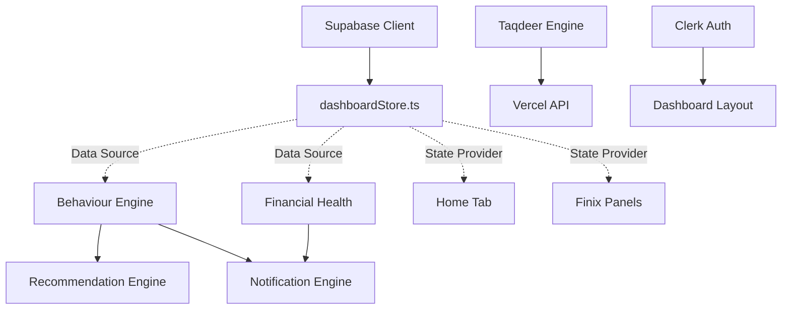

# Phase 12: Dependency Graph

Understanding how modules couple to one another.

## 1. Tight Coupling Analysis
*   **`dashboardStore.ts`**: The ultimate God Object. Every engine and major UI component imports this store directly. 
    *   *Risk*: If the schema of `Transaction` changes, every engine must be updated simultaneously. You cannot test the `BehaviourEngine` in isolation without mocking the entire Zustand store.
*   **`BehaviourEngine` -> `RecommendationEngine`**: The Recommendation engine does not calculate spending itself; it imports `BehaviourEngine.getTopCategories()`. This is good for DRY principles but means a bug in Behaviour breaks Recommendations.

## 2. Loose Coupling Analysis
*   **`features/finix`**: The Finix panels (`CibilPanel`, `UpiSimulatorPanel`) are highly decoupled from each other. Removing the `UpiSimulatorPanel` file and its route would have exactly zero impact on the rest of the application.
*   **`api/`**: The serverless functions are entirely decoupled from the React lifecycle.

## 3. Shared Dependencies
*   `lib/utils.ts` (`cn` tailwind merge function) is imported into nearly every UI component.
*   `types/dashboard.types.ts` is the central contract holding the TypeScript interfaces used by all features.
