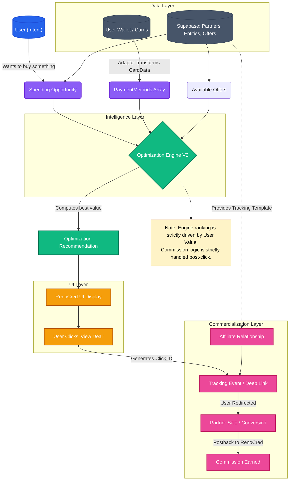

# RENO CRED COMMERCE ARCHITECTURE DIAGRAM

This diagram illustrates the decoupling between the Optimization Engine (Intelligence) and the Affiliate Layer (Commercialization).

```mermaid
flowchart TD
    %% Define styles
    classDef user fill:#2563eb,stroke:#1d4ed8,stroke-width:2px,color:#fff
    classDef engine fill:#10b981,stroke:#047857,stroke-width:2px,color:#fff
    classDef commerce fill:#8b5cf6,stroke:#6d28d9,stroke-width:2px,color:#fff
    classDef action fill:#f59e0b,stroke:#b45309,stroke-width:2px,color:#fff
    classDef affiliate fill:#ec4899,stroke:#be185d,stroke-width:2px,color:#fff
    classDef data fill:#475569,stroke:#334155,stroke-width:1px,color:#fff

    USER[("User (Intent)")]:::user
    
    subgraph Data Layer
        WALLET[(User Wallet / Cards)]:::data
        COMMERCE[(Supabase: Partners, Entities, Offers)]:::data
    end

    SPEND_OPP(Spending Opportunity):::commerce
    PAYMENT_METHODS(PaymentMethods Array):::commerce
    
    USER -->|Wants to buy something| SPEND_OPP
    WALLET -->|Adapter transforms CardData| PAYMENT_METHODS
    COMMERCE --> SPEND_OPP
    COMMERCE --> OFFERS(Available Offers)

    subgraph Intelligence Layer
        ENGINE{Optimization Engine V2}:::engine
    end
    
    SPEND_OPP --> ENGINE
    PAYMENT_METHODS --> ENGINE
    OFFERS --> ENGINE
    
    ENGINE -->|Computes best value| REC[Optimization Recommendation]:::engine
    
    subgraph UI Layer
        UI_DISPLAY[RenoCred UI Display]:::action
        CLICK[User Clicks 'View Deal']:::action
    end
    
    REC --> UI_DISPLAY
    UI_DISPLAY --> CLICK
    
    subgraph Commercialization Layer
        AFF_REL[Affiliate Relationship]:::affiliate
        TRACKING[Tracking Event / Deep Link]:::affiliate
        CONVERSION[Partner Sale / Conversion]:::affiliate
        COMMISSION[Commission Earned]:::affiliate
    end
    
    CLICK -->|Generates Click ID| TRACKING
    COMMERCE -.->|Provides Tracking Template| AFF_REL
    AFF_REL --> TRACKING
    TRACKING -->|User Redirected| CONVERSION
    CONVERSION -->|Postback to RenoCred| COMMISSION

    %% Note highlighting the core principle
    classDef note fill:#fef3c7,stroke:#d97706,stroke-width:1px,color:#000
    N1[Note: Engine ranking is strictly driven by User Value.<br/>Commission logic is strictly handled post-click.]:::note
    ENGINE -.-> N1
```
